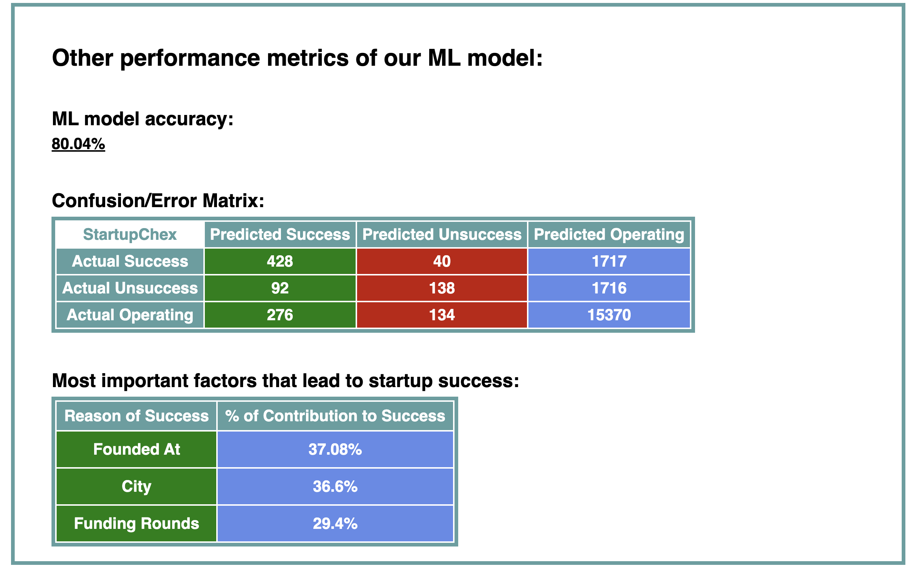

# StartupChex

StartupChex is an experimental project that predicts a startup company's future based its location, total amount of funding, founding date, etc. It uses ML to decide if a company will be a success, failure, or just operating.

- Input params: Industry, total amount of funding ($), location, # of funding rounds, founding date, date of first funding received, date of latest funding received.
- Predictions: Successful (IPO or acquired), failure (closed/shut down), operating (neither successful or failure, the company is just up and running).
- Use StartupChex if you want to get a glimpse of your startup's future
- Calculates the most important factors that lead to a startup's success or failure


Note: The ML model has an 80% accuracy, so please take StartupChex's predictions with a grain of salt. If its results show success, do not take it as an indicator/guarantee that your startup will be successful. If its results show failure, do not take it personally. Better accuracies coming soon!

## Why StartupChex was Built
- Built to boost my expertise and understanding of ML, Git/Bash, and full stack development
- This project was built as an experiment with ML and datasets. I love conducting experiments and finding out its results!
- Cures the infamous problem of self-doubt and imposter syndrome faced by new entrepreneurs. New founders will feel better if they find that StartupChex confirms their startup's success.
- Learned how to work with large datasets, build ML pipelines, and create a front-end for ML programs

## Installation
To clone and run this application, you'll need Scikit-Learn, Git, Python, Pandas, and Flask installed on your computer.  
From your command line:

``` sh
#Clone this repository
$ git clone https://github.com/Devbrianhuynh/startup-chex

# cd into the repository
$ cd startup-chex

# Install dependencies
$ pip install ir requirements.txt
```

## How to use
1. Install dependencies
2. Go into app.py
3. Run app.py
4. Go into startup_model_feedback.log
5. Copy the live server link
6. Open a web browser
7. Paste the live server link into the web browser and enter
8. Fill out the form:

9. See your results!:

10. See ML model accuracy:


## Credits  
This experiment uses the following packages and frameworks:
- [Scikit-Learn](https://scikit-learn.org/)
- [Pandas](https://pandas.pydata.org/)
- [NumPy](https://numpy.org/)
- [Python](https://www.python.org/)
- [Flask](https://flask.palletsprojects.com/en/3.0.x/)


## License
This project is licensed under the MIT License and was originally built by Devbrianhuynh

## How to Contribute
- Add new features
- Upgrade existing features
- Boost the accuracy of the ML model
- Add JS to make the project more interactive

## Tests
All tests to the program are included in every .py file, under the:
``` py
if __name__ == '__main__':
    #Tests included here
```